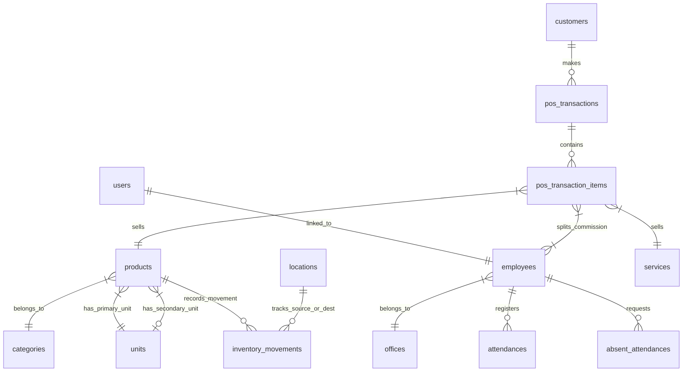

# Product Requirement Document (PRD) & Dokumentasi Teknis Terpadu
## K-Beauty Inventory, POS & HR System (Single Source of Truth)

---

## 1. PENDAHULUAN & TUJUAN PRODUK

Sistem K-Beauty adalah solusi multi-platform terpadu yang dirancang khusus untuk operasional salon kecantikan modern. Sistem ini memadukan modul **Web Dashboard Administratif** (Filament PHP) dengan **Aplikasi Kasir & Staf Mobile** (Flutter).

Tujuan utama dari sistem ini adalah:
1. **Transparansi Stok Real-time**: Menggunakan pembukuan berbasis ledger (*ledger-first*) di mana setiap pergerakan barang dicatat secara rinci.
2. **Point of Sale (POS) & CRM Terintegrasi**: Memfasilitasi transaksi layanan kecantikan, ritel produk, pembagian komisi staf, dan riwayat treatment pelanggan.
3. **Absensi Keamanan Tinggi (Smart HR)**: Memastikan kehadiran karyawan dengan verifikasi wajah ganda (AI deteksi landmark + RGB Manhattan distance) dan pembatasan geofencing.
4. **Alat Administrasi & Troubleshooting**: Memberikan wewenang penuh bagi Super Admin untuk mengelola data, konfigurasi versi, serta menyamar (*impersonation*) untuk memecahkan kendala pengguna.

---

## 2. ARSITEKTUR TEKNOLOGI & STACK

Sistem ini membagi beban kerja ke dalam dua bagian utama yang terhubung melalui REST API berbasis token Sanctum:

### 2.1. Backend & Admin Web
- **Framework Utama**: Laravel 11 (PHP 8.2+)
- **Admin Panel**: Filament v5 (CRUD administratif cepat, responsif, dan reaktif)
- **Database**: MariaDB / MySQL 8
- **Autentikasi & Guard**: Laravel Sanctum (untuk API Mobile) & Web Session (untuk Filament Dashboard)
- **Manajemen Hak Akses**: Spatie Laravel-Permission dengan Filament Shield
- **Pustaka Pendukung**:
  - `spatie/laravel-medialibrary` (penanganan media/gambar produk, izin, & portofolio)
  - `maatwebsite/excel` (ekspor Excel)
  - `barryvdh/laravel-dompdf` (ekspor PDF)

### 2.2. Mobile App (Flutter)
- **Framework**: Flutter SDK (Android/iOS)
- **State Management**: Provider
- **Penyimpanan Lokal**: Flutter Secure Storage (untuk token autentikasi) & Shared Preferences (konfigurasi lokal)
- **Daftar Plugin Utama**:
  - `google_mlkit_face_detection` (deteksi wajah AI offline)
  - `geolocator` (deteksi GPS untuk geofence)
  - `blue_thermal_printer` (pencetakan struk termal Bluetooth)
  - `package_info_plus` (pembacaan versi aplikasi lokal)
  - `url_launcher` (integrasi pengiriman pesan WhatsApp)
  - `flash` (tampilan notifikasi UI)

### 2.3. Estetika Desain (UI/UX) & Standardisasi Responsif
Seluruh aturan estetika, tema warna (Pink-primary), panduan Safe Area, dialog popup, standardisasi tata letak responsif (tablet vs mobile), dan alur responsif spesifik fitur diatur secara terpisah di dokumen [DESIGN-KBEAUTY.md](file:///c:/Users/aswin/.gemini/antigravity/scratch/inventory-system/DESIGN-KBEAUTY.md) yang berfungsi sebagai acuan desain sistem.

---

## 3. ARSITEKTUR DATABASE & KETENTUAN DATA

Sistem ini menerapkan konsep **"Ledger-First" (Buku Kas Mutasi)**. Data stok akhir tidak disimpan sebagai angka statis di tabel produk, melainkan dihitung secara dinamis dari akumulasi transaksi pergerakan barang.

### 3.1. Hubungan Antar Entitas (ERD)



### 3.2. Penjelasan Tabel Utama

#### 1. Katalog & Produk
- **`products`**: Menyimpan katalog utama produk. Memiliki relasi ke `categories` dan `units` (satuan). Menyimpan kolom `conversion_ratio` dan `secondary_unit_id` untuk mendukung dual-unit.
- **`categories`**: Pengelompokan produk (contoh: Eyelash, Alat Salon, Serum).
- **`units`**: Daftar satuan ukuran (contoh: Pcs, Box, Gram).

#### 2. Lokasi Fisik
- **`locations`**: Lokasi fisik penyimpanan stok (contoh: Gudang Utama, Store Kasir).

#### 3. Log Pergerakan (Ledger)
- **`inventory_movements`**: Satu-satunya sumber kebenaran jumlah barang.
  - Kolom `qty` selalu disimpan dalam **Primary Unit** (satuan terkecil).
  - Kolom `type` berupa enum: `IN` (masuk), `OUT` (keluar), atau `MOVE` (transfer).
  - Kolom `from_location_id` dan `to_location_id` mencatat asal dan tujuan mutasi stok.
  - Relasi polimorfik `reference` menghubungkan log pergerakan dengan transaksi sumber (misal: `Purchase` atau `StockOpname`).

#### 4. Transaksi & Rekonsiliasi
- **`inventory_transactions`** & **`inventory_transaction_items`**: Pembungkus untuk pencatatan transaksi barang masuk/keluar dalam jumlah banyak sekaligus (bulk).
- **`stock_opnames`** & **`stock_opname_items`**: Digunakan untuk audit berkala stok fisik per lokasi. Selisih antara perhitungan fisik staf dan ledger database akan memicu penyesuaian otomatis (*Adjustment movement*) di tabel `inventory_movements`.
- **`purchase_items`**: Menyimpan detail barang dan harga pada saat pembelian ke pemasok (*supplier*).

#### 5. Sumber Daya Manusia (HR) & Absensi
- **`employees`**: Profil karyawan operasional yang terhubung dengan akun `users` dan kantor `offices`. Menyimpan NIK, tanggal bergabung, dan data *face recognition embedding* (array 128 float).
- **`offices`**: Lokasi kantor absensi lengkap dengan koordinat latitude/longitude dan radius toleransi jarak (dalam meter).
- **`attendances`**: Log absensi harian karyawan (jam masuk, jam keluar, koordinat GPS, status check-in seperti `ONTIME`, `LATE`, `EARLY_CHECKOUT`).
- **`absent_attendances`**: Log pengajuan izin/sakit karyawan. Menyimpan tanggal mulai/selesai, alasan, dan bukti foto pendukung.
- **`shifts`**: Pengaturan jam kerja operasional harian.
- **`holidays`**: Hari libur nasional atau penutupan toko sementara.

#### 6. Point of Sale (POS) & CRM
- **`services`** & **`service_variants`**: Layanan jasa salon (contoh: Hair Spa) dengan variasi harga (contoh: Regular vs Premium).
- **`pos_transactions`** & **`pos_transaction_items`**: Log penjualan kasir, nominal bayar, diskon, metode pembayaran, dan detail staf penerima komisi.
- **`customers`** & **`customer_portfolios`**: Profil pelanggan salon beserta catatan riwayat kunjungan dan galeri foto treatment.

### 3.3. Aturan Integritas Data (Data Integrity Rules)
1. **Smallest-Unit-First**: Seluruh kuantitas yang memengaruhi perhitungan saldo stok pada database wajib dicatat dalam satuan terkecil (*primary unit*). Konversi dari satuan sekunder (misal: Box ke Pcs) dilakukan di tingkat antarmuka aplikasi (UI/UX) sebelum dikirim ke database.
2. **Lokasi Mutasi Wajib**: Setiap entri di `inventory_movements` harus memiliki referensi lokasi yang valid.
3. **SKU Unik**: Setiap produk wajib memiliki SKU yang unik dan terstandar untuk pencarian scan barcode/QR.

---

## 4. DETIL FITUR & SPESIFIKASI FUNGSIONAL

### 4.1. Web Dashboard (Filament)
- **CRUD Master Data**: CRUD lengkap untuk Produk, Layanan, Karyawan, Kantor, Supplier, dll.
- **HasStandardPageActions Trait (`App\Traits\HasStandardPageActions.php`)**:
  - Mengubah perilaku Filament bawaan. Menambahkan tombol "Back" di header halaman *Create* dan *Edit*.
  - Mengarahkan kembali pengguna ke halaman **List View** setelah menyimpan data, alih-alih menetap di halaman edit.
- **Refaktor Laporan Kartu Stok (`App\Filament\Pages\StockCardReport.php`)**:
  - Menggunakan tabel Filament asli (`Filament\Tables\Table`) untuk tampilan yang lebih responsif dan premium.
  - Filter lokasi yang dinamis (bisa memilih satu lokasi tertentu atau "All Locations").
  - Menghitung saldo awal (sebelum rentang tanggal), mutasi masuk/keluar selama periode, dan saldo akhir secara dinamis menggunakan perhitungan berbasis PHP (untuk kestabilan kolom virtual).
  - Filter produk opsional ("All Products" atau satu produk spesifik).
  - Tombol Ekspor langsung ke Excel (.xlsx) dan PDF (melalui Blade custom).
- **App Versioning**:
  - Pengaturan `latest_version`, `apk_url`, dan status `is_mandatory_update` untuk memantau versi aplikasi mobile yang digunakan staf.
- **Super Admin Impersonation**:
  - Tombol menyamar (*Impersonate*) pada daftar pengguna untuk mempermudah administrator menguji hak akses atau menyelesaikan keluhan staf dari perspektif mereka langsung.

### 4.2. Aplikasi Mobile (Flutter)
- **Persistent Login**: Menggunakan Laravel Sanctum token yang disimpan secara aman di secure storage perangkat.
- **Smart Attendance (Absensi)**:
  - **Offline Humanity Check (Google ML Kit)**: Kamera akan memindai wajah karyawan secara lokal. Absen hanya diizinkan jika:
    1. Landmark wajah lengkap (mata kanan, kiri, dan mulut terdeteksi).
    2. Posisi kepala tegak (kemiringan Euler X, Y, Z tidak boleh lebih dari $\pm 20^{\circ}$).
    3. Wajah proporsional (mengisi minimal 25% area layar).
    4. Menyaring objek non-manusia secara otomatis menggunakan Humanity Checks.
  - **Geofencing**: Menggunakan plugin `geolocator` untuk membandingkan koordinat GPS staf dengan koordinat kantor absensi. Tombol absen terkunci jika staf berada di luar radius kantor yang diizinkan.
  - **Verifikasi Wajah Sisi Server**: Foto yang diambil dikirim ke backend dan dicocokkan dengan foto profil terdaftar melalui algoritma Manhattan Distance RGB berbobot Gaussian. Lulus absen memerlukan tingkat kecocokan minimum **80%**.
  - **Personal History**: Karyawan dapat melihat riwayat kehadiran mereka yang dikelompokkan berdasarkan bulan.
  - **Pengajuan Izin**: Mengunggah detail izin dan melampirkan beberapa foto dokumen pendukung langsung dari kamera ponsel.
- **Katalog Produk & Kasir POS**:
  - Pencarian katalog responsif dengan visualisasi barang non-aktif yang diburamkan (*dimmed*) dengan label "NON-AKTIF".
  - **Designated Employee**:
    - Kasir wajib memilih staf penanggung jawab treatment untuk perhitungan komisi.
    - Aplikasi secara otomatis menginisialisasi nama staf dengan pengguna yang sedang login untuk kemudahan transaksi.
    - Akun `super_admin` disaring dari daftar pemilihan staf agar komisi teralokasi tepat sasaran.
    - Menampilkan staf dengan status aktif saja.
  - **Pencarian Pelanggan**:
    - Dialog pencarian pelanggan berdasarkan nama atau nomor telepon. Nomor telepon ditampilkan berdampingan di UI untuk menghindari kesalahan input pada nama pelanggan yang kembar.
    - Pemilihan pelanggan bersifat wajib sebelum transaksi kasir diselesaikan guna penerbitan tagihan.
  - **Metode Pembayaran & Cetak Struk**:
    - Mendukung metode Tunai, Debit, Kredit, dan QRIS.
    - Pencetakan struk penjualan fisik melalui printer termal Bluetooth.
    - Berbagi struk digital via WhatsApp (format teks menyertakan nama pelanggan secara otomatis).
- **Mandatory Update Dialog**:
  - Saat aplikasi mobile dibuka, ia akan membandingkan versinya dengan `latest_version` di backend.
  - Jika terjadi ketidakcocokan dan status update adalah wajib (*mandatory*), aplikasi menampilkan dialog pemblokiran layar penuh dengan tautan unduhan APK yang tidak bisa dilewati.
---

## 5. DETAIL LOGIKA VERIFIKASI WAJAH BACKEND

Metode pencocokan wajah diimplementasikan di `AttendanceController.php` dengan rincian logika sebagai berikut:

1. **Fast RGB Manhattan Distance**:
   Mengukur perbedaan warna pixel-by-pixel antara foto absensi baru dengan foto profil referensi untuk mendeteksi kesamaan visual dasar.
2. **Gaussian Center Weighting**:
   Menerapkan bobot non-linear (mengikuti kurva Gaussian) yang berpusat pada bagian tengah gambar. Pixel di tepi/latar belakang foto akan diabaikan secara matematis, sehingga variasi latar belakang tempat absen tidak merusak akurasi skor kecocokan wajah.
3. **Pemberhentian Aman**:
   Jika profil karyawan belum memiliki foto referensi, backend otomatis mengembalikan skor kemiripan $0\%$ untuk mencegah celah lolos absensi tanpa foto profil.

---

## 6. PROSEDUR DEPLOYMENT & MAINTENANCE

### 6.1. Deployment Backend (Laravel)
Rekomendasi server: Linux VPS (Ubuntu 22.04+) dengan PHP 8.2+, Nginx, dan MySQL 8.

```bash
# 1. Kloning Repositori
cd /var/www
git clone https://github.com/aswinadi/kbeauty.git
cd kbeauty/backend

# 2. Konfigurasi Environment
cp .env.example .env
nano .env # Sesuaikan APP_URL, koneksi DB_DATABASE, DB_USERNAME, DB_PASSWORD, dan FILESYSTEM_DISK=public

# 3. Instalasi Dependensi
composer install --no-dev --optimize-autoloader
npm install && npm run build

# 4. Inisialisasi Aplikasi
php artisan key:generate
php artisan storage:link
php artisan migrate --force
php artisan filament:optimize
```
*Pastikan konfigurasi virtual host Nginx Anda diarahkan ke direktori `/var/www/kbeauty/backend/public`.*

### 6.2. Deployment & Build Aplikasi Mobile (Flutter)

#### Konfigurasi Endpoint API
Ubah alamat base URL API pada file `mobile/lib/services/inventory_service.dart`:
```dart
static const String baseUrl = 'https://domain-anda.com/api';
```

#### Kompilasi untuk Android (APK Release)
```bash
cd mobile
flutter clean
flutter pub get
flutter build apk --release \
  --dart-define=ENV=prod \
  --dart-define=API_URL=https://inventory.maxmar.net/api \
  --build-name=1.0.0 \
  --build-number=1
```
*Catatan: APK hasil build akan berlokasi di `build/app/outputs/flutter-apk/app-release.apk`.*

#### Konfigurasi Distribusi Manual & Mandatory Update
Apabila mendistribusikan aplikasi secara manual (hosting mandiri APK di server):
1. Salin file APK hasil kompilasi ke direktori publik backend:
   ```bash
   mkdir -p /var/www/kbeauty/backend/public/downloads
   cp build/app/outputs/flutter-apk/app-release.apk /var/www/kbeauty/backend/public/downloads/kbeauty-latest.apk
   ```
2. Buka Web Dashboard Filament, masuk ke menu **General Settings > App Versioning**.
3. Set **Latest App Version** sesuai dengan nilai `--build-name` yang Anda gunakan (contoh: `1.0.0`).
4. Set **APK Download URL** ke tautan unduhan publik Anda (contoh: `https://domain-anda.com/downloads/kbeauty-latest.apk`).

#### Kompilasi untuk iOS (IPA Archive)
*Memerlukan komputer macOS, Xcode, dan Apple Developer Account.*
1. Buka folder iOS proyek di Xcode:
   ```bash
   open mobile/ios/Runner.xcworkspace
   ```
2. Atur tim developer dan kelola penandatanganan sertifikat secara otomatis (*Automatically manage signing*) di bawah menu **Runner Target > Signing & Capabilities**.
3. Jalankan perintah kompilasi IPA di terminal:
   ```bash
   cd mobile
   flutter build ipa --release \
     --dart-define=ENV=prod \
     --dart-define=API_URL=https://inventory.maxmar.net/api \
     --export-options-plist=ios/ExportOptions.plist
   ```
4. Atau gunakan menu Xcode: **Product > Archive**, lalu pilih **Distribute App** melalui Organizer untuk mengunggah ke TestFlight atau App Store.

### 6.3. Pemeliharaan Sistem Pasca Deployment
- **Cron Job Laravel**: Aktifkan Laravel Scheduler di server Anda untuk menjalankan tugas terjadwal seperti rekapitulasi data:
  ```cron
  * * * * * cd /var/www/kbeauty/backend && php artisan schedule:run >> /dev/null 2>&1
  ```
- **Sertifikat SSL**: Selalu gunakan protokol HTTPS (misalnya menggunakan Certbot / Let's Encrypt) demi menjaga keamanan pengiriman token otorisasi Sanctum dan data absensi.

---

## 7. MILESTONE IMPLEMENTASI PROYEK

Proses pengembangan dan rekonstruksi sistem dibagi menjadi 6 tahap milestone berikut:

```mermaid
gantt
    title Tahapan Milestone Pengembangan K-Beauty System
    dateFormat  YYYY-MM-DD
    section Backend & Core
    Phase 1: Setup Laravel, Filament & Spatie Permission :active, p1, 2026-06-01, 10d
    Phase 2: Logika Buku Stok (Multi-UOM) & Laporan Kartu Stok : p2, after p1, 12d
    section Integrasi HR & Absensi
    Phase 3: Integrasi API Absensi & Verifikasi Wajah Sisi Server : p3, after p2, 10d
    section Kasir POS & Mobile Client
    Phase 4: POS, Komisi Karyawan, Riwayat CRM & Cetak Termal : p4, after p3, 14d
    Phase 5: Kerangka Flutter Mobile & Sinkronisasi API : p5, after p4, 8d
    Phase 6: Fitur Mobile Lanjutan (Deteksi Wajah Lokal & Pemblokiran Versi) : p6, after p5, 12d
```

1. **Phase 1**: Instalasi Laravel, integrasi Filament Admin Dashboard, pengaturan hak akses dasar Spatie Permission dan Filament Shield.
2. **Phase 2**: Implementasi logika penyimpanan stok "Smallest-Unit-First", pembuatan tabel pergerakan stok polimorfik, serta pembuatan laporan Kartu Stok terpadu.
3. **Phase 3**: Pembuatan API HR, validasi geofencing lokasi kantor, serta mesin verifikasi wajah (RGB Manhattan Distance + Gaussian Center Weighting).
4. **Phase 4**: Pembuatan modul POS di backend, penanganan varian layanan, sistem bagi komisi staf, serta penataan basis data profil pelanggan dan portofolio kunjungan.
5. **Phase 5**: Pembangunan basis aplikasi mobile Flutter, sinkronisasi data API Sanctum, dan pembuatan CRUD produk/katalog lewat mobile.
6. **Phase 6**: Integrasi SDK ML Kit offline di Flutter, validasi koordinat landmark wajah, integrasi printer termal Bluetooth di mobile, dan implementasi dialog Mandatory Update.

---

## 8. INTEGRASI KUNCI ANTAR MODUL
- **Pemotongan Stok POS Otomatis**: Ketika transaksi layanan kecantikan (Service) diselesaikan di kasir mobile, sistem secara otomatis melacak daftar "Bahan Baku" (Materials) yang digunakan oleh layanan tersebut, lalu memotong jumlah produk terkait pada lokasi "POS Display Location" menggunakan entri mutasi stok `OUT`.
- **Jembatan Hak Akses Web-API**: Sistem memetakan string permission dari Spatie Shield yang digunakan pada Filament Dashboard (contoh: `view_any_product`) langsung ke dalam hak akses autentikasi API mobile (guard `sanctum`), menjamin konsistensi pembatasan menu dan fitur bagi staf di lapangan.
